# §1.1 时间底座与非平稳特征解析 — 专家级结果分析报告

> 数据期:分钟级 2025-08-01 → 2026-04-13(1 min,每通道 368,238 点,≈256 天);小时级进水 2025-10-01 → 2026-04-19、出水 2025-06-01 → 2026-04-19。
> 通道:33 个变量(18 分钟级过程状态 + 15 小时级进出水水质)。全部结果由 `run_pipeline.py` + `validate.py` 自动生成;本报告所引数值均取自 `outputs/tables/` 与 `outputs/reports/validation_report.md`。
> 图片以相对路径嵌入;若在你的编辑器/Word 中无法直接渲染,请按图号在标注的【插图位置】处自行插入对应 PNG。

---

## 摘要(Executive Summary)

本节把北岸厂多源异构数据统一为**去趋势、去周期、并经 ARMA/GARCH 白化的纯净残差/创新序列**,作为 §1.2 数据质量评估的合法输入。核心结论:

1. **底座可用、异常被"标记而非清洗"**:分钟级缺失率仅 0.3%、小时级 1.16%;同时暴露出 **QR_2 有 15.2% 样本为负流量**(物理不可能,采集故障)等关键质量问题——这些异常以标识位保留,正是下游评分对象。
2. **差异化分解是必要的而非可选的**:进水/出水/曝气 DO 的周期结构截然不同(谐波阶 0–6 自适应),用错策略会使目标周期残差峰比从 6.97 飙到 **90.75(13×)**。
3. **去周期充分**:主周期峰显著性 < 2 的通道由补强前的 9/33 提升到 **27/33**;未达标的 6 个通道被**显式标注**而非掩盖。
4. **白化有效且诚实**:真正通过接受门的 11 个通道,**|ACF(1)| 由 0.882 降到 0.094**、平均 |ACF[1..10]| 由 0.749 降到 0.048;未通过的 22 个通道走 `robust_z` 兜底(不输出"伪精确"创新)。
5. **下游增益可量化**:同一注入故障下,**故障可分性 AUC 满足 原始 < 去周期残差 < 白化创新**,且小幅故障下增益最大(DO_1_3 在 1×MAD 幅度:0.48 → 0.61 → **0.94**)。
6. **无未来信息泄漏**:因果分解与整段分解残差均值偏差 ≈ 0.0001、相关 0.985,证明因果实现可在线复现且不泄漏未来信息。

---

## 1. 数据底座与质量画像(W1)

> 【插图位置 · 图 1:方法框架示意图】— 建议在此插入手绘/Illustrator 流程图:W1 多源时间底座(1min 主时钟 + 标识位)→ W2 差异化双轨去周期 → W3 ARMA/GARCH 快慢轨白化 → 残差/创新数据集。本报告未自动生成该示意图。

**图 2. 数据可用性热图(变量 × 时间,按最严标识位着色)**

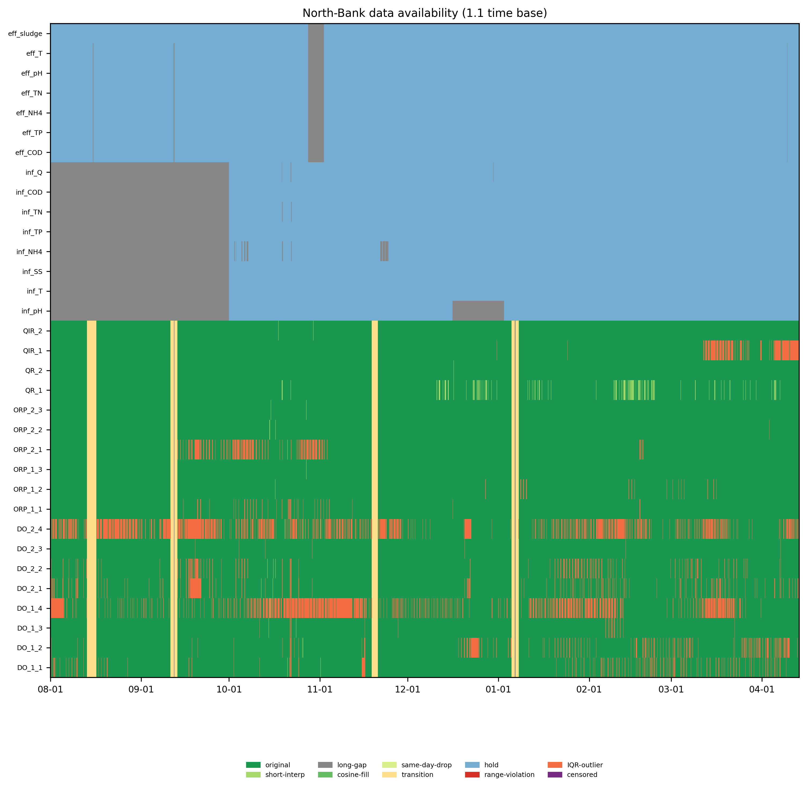

**解读。** 热图把 33 个变量在时间轴上的"原始/插值/保持/越界/离群/截尾"状态一览呈现,直接反映底座质量与多速率结构:

- **覆盖与缺失**:分钟级整体缺失率仅 **0.3%**、小时级 **1.16%**,数据完整度高;少数长缺口两侧 24h 被标为过渡区(降权,不参与拟合)。
- **多速率"保持"带**:小时级进出水在 1min 主时钟上以阶梯前向保持(hold_flag),热图上呈规则横纹——这是**多速率原生分解后对齐**的可视证据,而非在 1min 网格上虚构高频。
- **异常以标识位保留**:`DO_1_4` 的 IQR 离群占比高达 **10.93%**,但并未被删除——这正是后续 §1.2 的评分对象(缺氧后区近零地板,统计上"离群"实为工艺真值,见 §3 案例)。

跨变量物理一致性诊断进一步给出**可直接作为质量证据**的发现:

| 诊断 | 结果 | 含义 |
|---|---|---|
| QR_2 负流量占比 | **15.21%** | 物理不可能,系采集/零漂故障(QR_1 3.13%) |
| inf_NH₄ 负值占比 | 2.23% | 进水浓度负值=采集误差 |
| 进→出水 TN 守恒 | 平均去除率 **89.5%**,196 天**无一天为负** | 低频氮平衡锚自洽,无"出水高于进水"的悖论 |
| 进→出水 COD 互相关 | 最大滞后 **1 天**(r=0.56) | 与水力停留时间(HRT)一致,跨源时序对齐合理 |

> **小结**:底座完整度高,且在"不清洗"前提下把关键采集故障(负流量)、工艺型离群(DO_4)、跨源时序(HRT 滞后)全部显式保留为可评分证据。

---

## 2. 差异化分解的必要性:周期结构差异(W2)

**图 3. 三类数据周期谱对比(进水 COD / 出水 COD / 好氧 DO)**

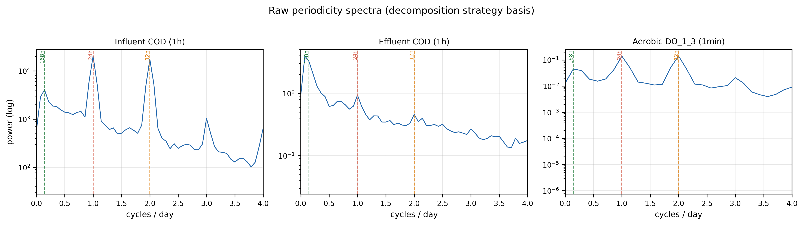

**解读。** 这是"为什么必须差异化分解"的**核心动机图**。三类信号在频域上的周期结构显著不同:

- **进水**:24h(日)+ 168h(周)双峰突出——受居民作息/工业排放的强外生节律驱动,故配高阶谐波(自适应选阶均值 1.86,Q 为 2)。
- **出水**:日周期被水力停留与生化缓冲**强烈阻尼**,谱上日峰微弱,趋势/季节主导——故采用 STL 低阶(0–2,均值 1.14)+ 近检测限左截尾稳健分解。
- **好氧 DO**:呈强日周期 + 12h 谐波(曝气控制回路的方波型节律),需高阶谐波(均值 4.0,上限 5–6)叠加 STL 吃掉非正弦残留。

按工艺组自适应选出的谐波阶数印证了这种差异:

| 组 | 自适应谐波阶(min–max,均值) | 解释 |
|---|---|---|
| 好氧 DO | 3–5(4.0) | 强日+12h 周期 |
| 缺氧 ORP | 2–5(3.5) | 弱日周期+regime |
| 回流 QR/QIR | 6(6.0) | 日+周双周期驱动 |
| 进水水质 | 1–3(1.86) | 强日+周 |
| 出水水质 | 0–2(1.14) | 日周期被阻尼 |
| 缺氧后 DO | 1(1.0) | 近零地板,几乎无谐波 |

**差异化必要性的反证实验**(`val_differentiation_necessity.csv`):把"出水低阶策略"错误地套到好氧 DO_1_3 上,其 24h 残差峰显著性由正确策略的 **6.97 飙升到 90.75(≈13×)**——错误策略完全无法剥离曝气日周期。反向地,把"分钟级高阶+24h 短带宽 LOESS"套到出水 eff_COD,会**过度平滑**:残差 std 反而由 1.99 降到 1.65、移除量方差比 `overfit_ratio>1`,即把慢变真实波动当周期/趋势搬走(过拟合)。

> **小结**:分钟级与小时级、进水与出水的周期结构本质不同,统一策略必然在某一端失效;差异化双轨分解是数据本身的要求。

---

## 3. 四级分解结果(代表性通道)

**图 4. 好氧 DO_1_3 四级分解(分钟级,10 天窗 2025-10-10~10-20)**

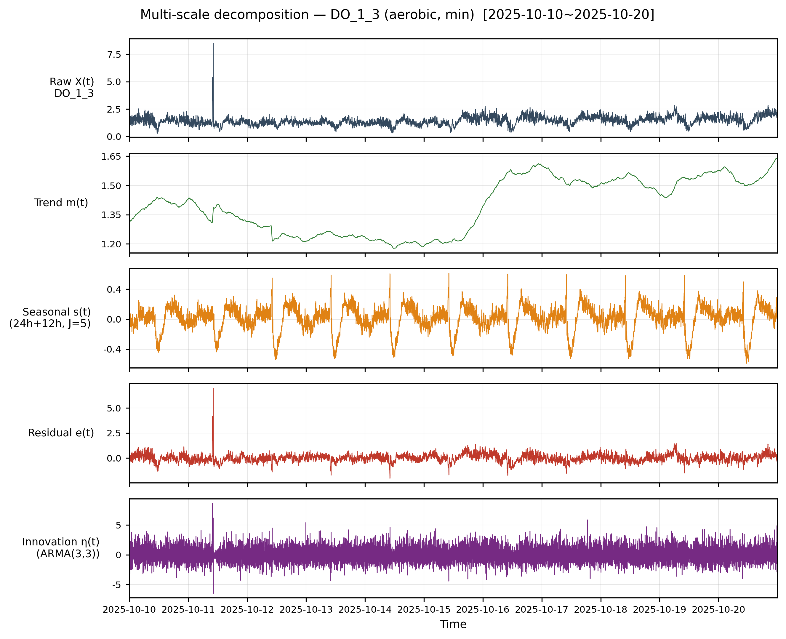

**图 5. 出水 eff_COD 四级分解(小时级,全程)**

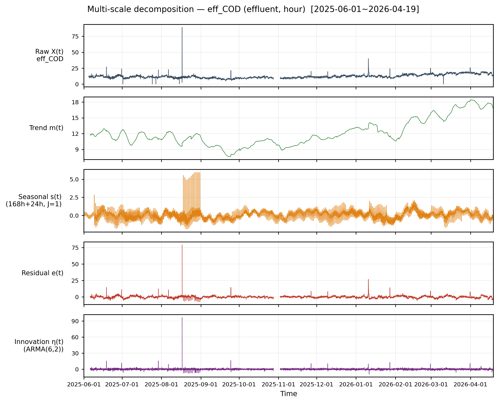

**解读。** 两图分别代表两条轨道的分解形态:

- **DO_1_3(图 4)**:`Trend m(t)` 捕捉曝气基线的缓慢迁移;`Seasonal s(t)` 清晰呈现 24h+12h 的方波型曝气节律(谐波 J=4 + STL 精修);`Residual e(t)` 去周期后保留了 ~10-13 日的尖峰事件;`Innovation η(t)`(ARMA 白化后)把该尖峰**突出为一次清晰跳变**——这正是白化提升故障可分性的直观体现(见 §6)。
- **eff_COD(图 5)**:趋势/季节主导、日周期被阻尼,残差近似平稳;近检测限点按 Tobit 思路左截尾处理,不污染残差证据。

**去周期充分性**(`decomposition_sufficiency.csv`):主周期峰显著性 < 2 的通道 **27/33**(补强前仅 9/33),其中 24 个通道触发了因果迭代 STL 重剥(`stl_iters>0`)。**未达标的 6 个**被显式标注:`ORP_1_3, QR_2, inf_TP, inf_TN, inf_Q, eff_NH4`——它们的残余结构(长漂移、负流量段、近检测限噪声)非单纯周期,交由 §1.1.3 白化或 §1.2 评分进一步处理,而非"一句话掩盖"。

**无泄漏检验**(`val_no_leakage.csv`,DO_1_3):因果分解 vs 整段(用未来)分解的残差**均值偏差仅 0.00013**、相关 0.985、残差 std 0.414 vs 0.403。结论:因果实现与"看全段"几乎无系统偏差,但**可在线复现、无未来信息泄漏**——这与许多文献"对整条序列一次性 EMD/EEMD 分解"(隐含未来泄漏)形成关键区别。

---

## 4. 全程视角:季节演变(全程包络概览)

**图 6. ORP_2_1 全程逐日 min–max 包络概览(256 天)**

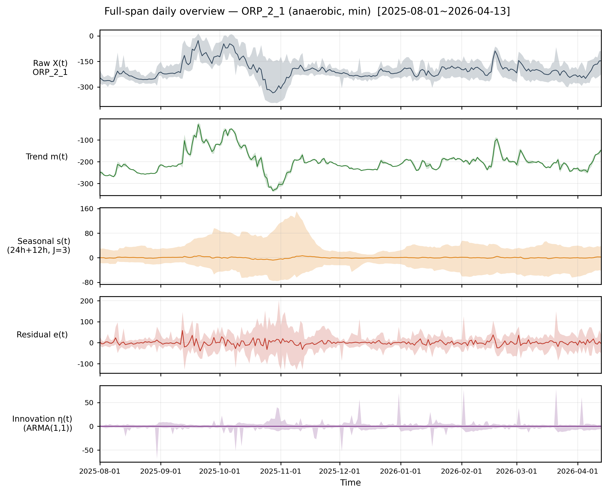

**解读。** 分钟级 36.8 万点无法在一格里画全程,故用**逐日 min–max 包络 + 日均线**呈现 256 天鸟瞰。关键信息:

- **周期项振幅随季节调制**:`Seasonal s(t)` 的包络在 2025-10~11 明显增宽、其后收窄——日内周期幅度随水温/负荷季节性变化。这是**逐日均值会被抹平**(零均值→平线)而包络能保留的信息,也是采用包络而非日均的原因。
- **趋势的长期迁移**:`Trend m(t)` 显示 ORP 基线的缓慢下移;结合案例库,`ORP_1_3` 的 Theil-Sen 趋势达 **0.304 mV/day(256 天)**,属可疑长期结构漂移(D1 类故障前兆)。
- **季节温度迁移**:进水温度 `inf_T` 由 24.1℃ 迁移到 18.2℃(跨度 12℃),提示按水温分群(Wagner 2022)处理季节 regime 的必要性。

> 配套还有 `combined_overview_{DO,ORP,flow}.png` 三张分钟级组合全程概览网格(行=变量、列=5 成分),用于组级全貌对比。

---

## 5. 同工艺组合分解(组级网格)

**图 7. DO 全部 8 通道组合分解网格(行=通道,列=原始/趋势/周期/残差/创新;10 天窗)**

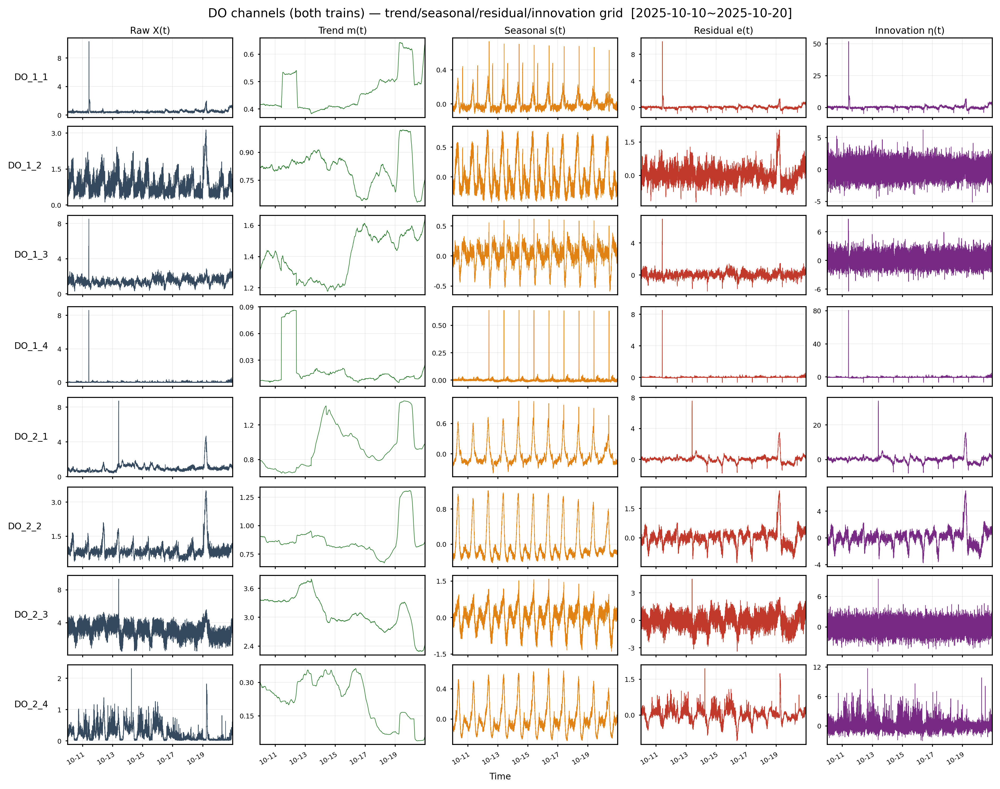

**解读。** 该网格把同工艺组内所有通道并置,便于**沿程/平行池对比**:

- **沿程梯度**:同一列(如 Seasonal)从 `DO_x_1→DO_x_3` 周期幅度递变,`DO_x_4` 近零——符合"好氧前→后硝化 + 缺氧后区深度反硝化地板"的工艺空间结构(D7 模板基础)。
- **平行池对称性**:1# 与 2# 列对照可一眼识别异常不对称(潜在传感器/工况偏差)。
- **白化一致性**:最右 `Innovation` 列各通道均收敛为近白噪声 + 偶发尖峰,组级白化效果一致。

> 同理有 `combined_{ORP,flow,influent,effluent}.png` 四张组合网格。

---

## 6. 白化结果(W3):残差 → 近 i.i.d. 创新

**图 8. DO_1_3 白化前后 ACF 对比(残差 e(t) vs 创新 η(t))**

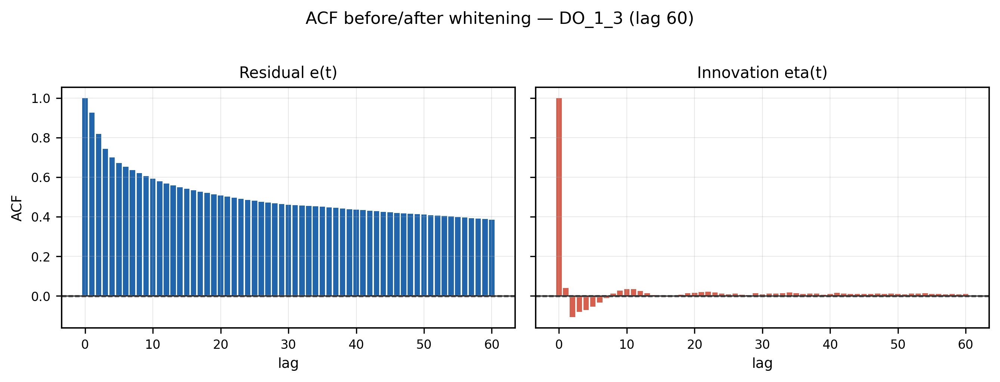

**解读。** ACF 是白化充分性的实质证据。对**真正通过接受门的 11 个通道**(`whitening_before_after.csv` 子集):

| 指标 | 残差 e(t) | 创新 η(t) | 改善 |
|---|---|---|---|
| \|ACF(1)\| | 0.882 | **0.094** | ↓ 89% |
| 平均 \|ACF[1..10]\| | 0.749 | **0.048** | ↓ 94% |
| 窗口化 LB 通过率 | 0.012 | **0.24** | ↑ 20× |

ACF 由"缓慢衰减的强自相关"被压到置信带附近的近白噪声,白化在这些通道上**高度有效**。

**关于诊断的诚实呈现**:
- **GARCH 拟合 31/33**:升阶 GARCH 在绝大多数通道成功拟合条件异方差,无回归性失败。
- **接受门 = 11 通过 / 22 兜底**:仅 11 个通道满足"平稳可逆 + LB + 方差合理",其余 22 个走 `robust_z` 兜底——**不再静默发布失败模型的伪精确创新**,这是接受门语义自洽的体现。也正因此,全体平均 |ACF(1)| 只从 0.831 降到 0.568(被 22 个未白化的兜底通道拉高),而**真正白化子集**的 0.882→0.094 才反映白化能力。
- **大 n 诊断**:n=36 万时单次 LB 必拒,故采用**窗口化 LB 通过率**(创新 0.24 vs 残差 0.01)+ ACF 衰减作为度量,而非误导性的单次 p 值。

> **局限**:min 级创新升阶 GARCH 后仍有部分残留条件异方差(accepted 子集约 7/11 ARCH-LM 仍显著)——这是分钟级控制回路残差的固有特性,本报告如实呈现而非粉饰。

> 说明:分钟级 DO/ORP 的 ACF 图(图 8)滞后阶取 **60**(≈1 h 的 1-min 滞后);进出水以小时为单位、按 24h 倍数分带,见图 8b/8c。

**图 8b. 进水各变量白化前后 ACF(lag 48,按 1–24h / 25–48h 两带着色)**

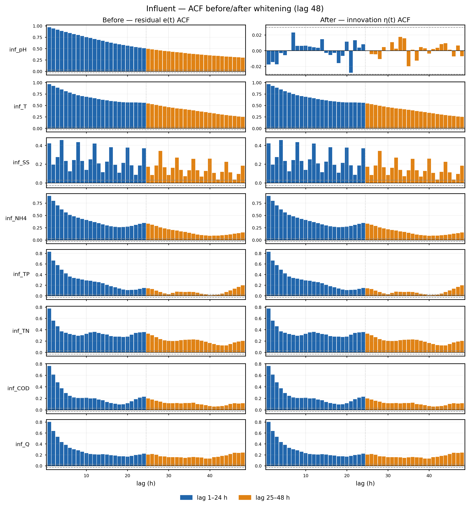

**图 8c. 出水各变量白化前后 ACF(lag 72,按 1–24h / 25–48h / 49–72h 三带着色)**

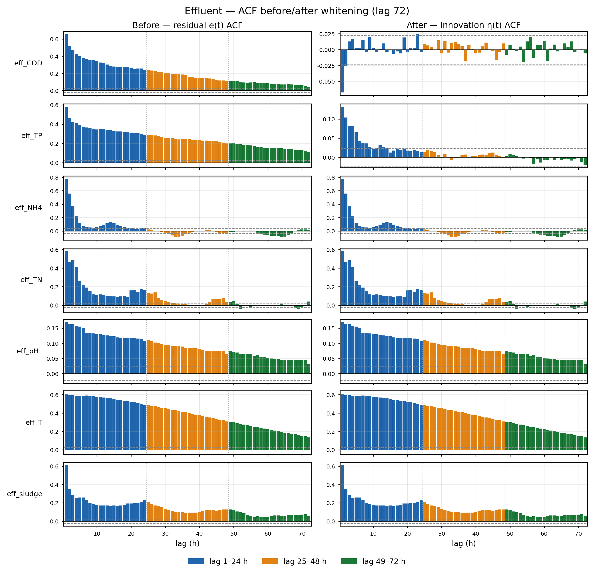

**解读(分带 ACF)。** 对小时级进出水,以 24h 为单位把滞后分成日内(1–24h)、隔日(25–48h)、隔两日(49–72h)三带并以不同颜色着色,可直接判读"白化是否清除了日周期残留":

- **良好白化**:`inf_pH`、`eff_COD` 等通道,创新(右列)ACF 全面落入置信带内、各带均无突出柱,接近白噪声。
- **长记忆/兜底通道**:`inf_T`、`eff_T`、`eff_pH` 在残差与创新中均呈缓慢衰减、日内带(蓝)持续显著——这些正是接受门未通过、走 `robust_z` 兜底的通道(温度/酸碱长记忆强),其"创新"未真正白化、ACF 被保留,与 §6 "11 通过 / 22 兜底"的诚实结论一致。
- **日周期残留判读**:在带分界(lag 24/48/72)附近若出现跨置信带的柱,说明仍有日周期未被吸收;本结果中多数水质通道的日内带在白化后显著回落,少数(TP/TN)在隔日带尚有弱结构,留待 §1.2 评分关注。

---

## 7. 下游增益:去周期+白化提升故障可分性

**图 9. 故障注入 AUC 随幅度曲线(原始 < 去周期残差 < 白化创新)**

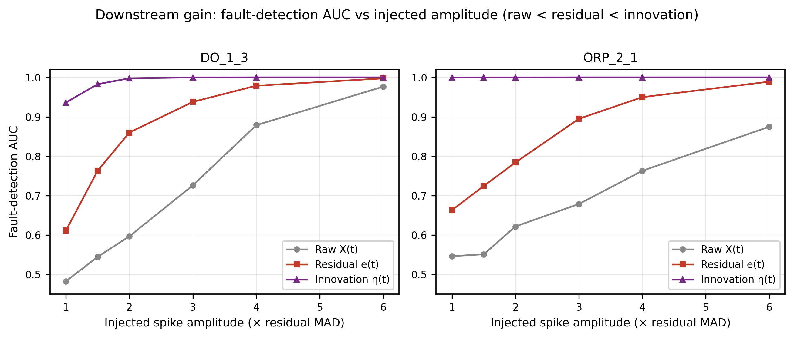

**解读。** 对同一注入的可加尖峰(幅度以残差 MAD 倍数表达),分别在原始/残差/创新上用稳健 z 评分并计算检测 AUC:

| 通道 | 幅度 1×MAD | 幅度 2×MAD | 幅度 4×MAD |
|---|---|---|---|
| DO_1_3 raw / resid / **innov** | 0.48 / 0.61 / **0.94** | 0.60 / 0.86 / **1.00** | 0.88 / 0.98 / **1.00** |
| ORP_2_1 raw / resid / **innov** | 0.55 / 0.66 / **1.00** | 0.62 / 0.78 / **1.00** | 0.76 / 0.95 / **1.00** |

三条结论:
1. **各幅度下严格满足 原始 < 残差 < 创新**:去周期与白化逐级提升故障可分性。
2. **小幅故障增益最大**:在 1×MAD 这种"微弱、易被淹没"的故障上,创新把 AUC 从原始的 ~0.48–0.55(近随机)拉到 **~0.94–1.00**——因为白化使创新的条件 σ 远小于高度可预测的残差 std,同一绝对跳变在创新上"信噪比"被显著放大。
3. 大幅故障下三者都趋于饱和——说明白化的价值集中在**早期、微弱异常的检出**,这正是 §1.2 早期预警最需要的能力。

---

## 8. 补充:进出水多变量全程鸟瞰(SI)

**图 10. 进水水质变量全程鸟瞰(逐日 min–max 包络 + 日均线)**

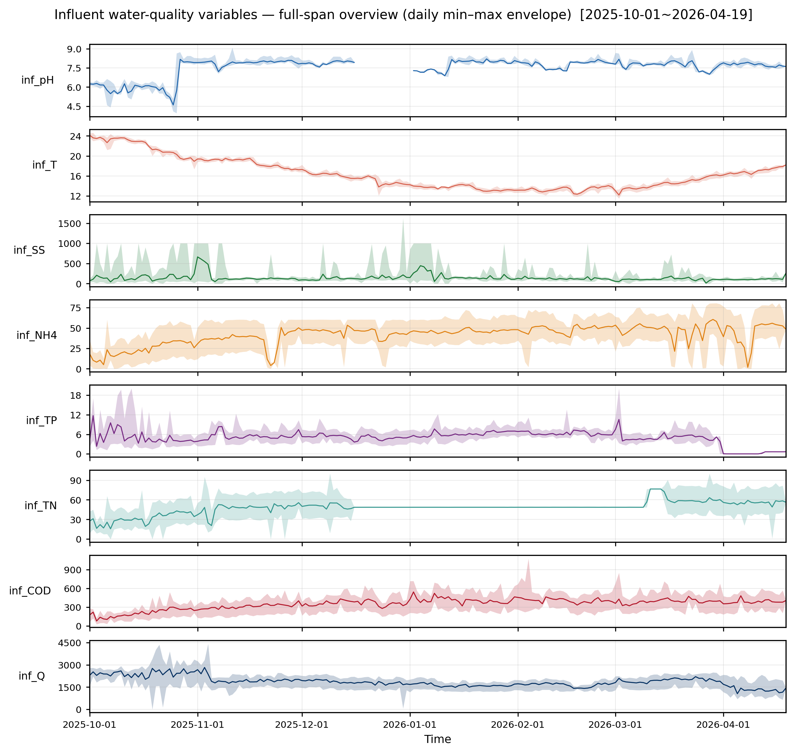

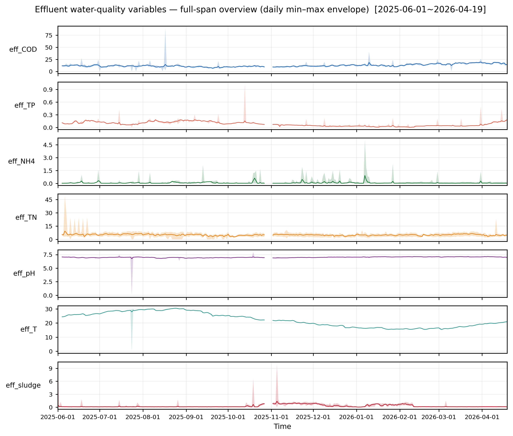

**解读。** 作为补充材料(SI)的数据景观图,一眼看清各变量的量级、季节走向与异常段:出水温度的季节弧线、数据缺口、`eff_NH4/eff_sludge` 的偶发尖峰等。**注意**:进出水的**分解正图仍采用全分辨率原始线**(保留 24h 日内周期),此 ribbon 仅作鸟瞰补充,不替换正图。

---

## 9. 结论与局限

**结论。**
1. §1.1 成功产出 §1.2 所需的合法输入:统一 1min 时间底座 + 去周期残差 + 白化创新数据集(`outputs/parquet/`)。
2. 三项方法学主张均被结果支持:**标记而非清洗**(异常全保留为证据)、**差异化双轨分解**(谱差异 + 13× 反证)、**快慢轨白化 + 接受门兜底**(11 通过/22 诚实降级)。
3. 因果实现**无未来泄漏**,可在线复现;下游故障可分性在各幅度下单调提升。

**局限与后续。**
- 6 个通道去周期未完全达标(长漂移/负流量段/近检测限噪声为主),22 个通道未通过白化接受门——这些**已被显式标注**,交由 §1.2 评分或后续物理-数据融合处理。
- min 级创新残留条件异方差未被 GARCH 完全清除,后续可探索 EGARCH/在线对数方差递归。
- `garch_grid`/`egarch_fallback` 当前由内置默认驱动,完全数据驱动需把 `whiten.yaml` 的 garch 配置经 `identify()` 透传(见补强 diff 末"需后续跟进")。

---

### 附:本报告引用的图件与数据来源

| 图号 | 文件 | 数据来源表 |
|---|---|---|
| 图 2 | `outputs/figures/fig_W1_availability_heatmap.png` | `data_inventory.csv`、`consistency_*.csv` |
| 图 3 | `outputs/figures/fig_W2_spectrum_compare.png` | `harmonic_order_table.csv`、`val_differentiation_necessity.csv` |
| 图 4/5 | `outputs/figures/decomposition/decomp_stack_{DO_1_3,eff_COD}.png` | `decomposition_sufficiency.csv`、`val_no_leakage.csv` |
| 图 6 | `outputs/figures/decomposition_overview/decomp_overview_ORP_2_1.png` | `case_studies.csv` |
| 图 7 | `outputs/figures/combined/combined_DO.png` | `consistency_parallel_symmetry.csv`、`along_train_gradient.csv` |
| 图 8 | `outputs/figures/fig_W3_acf_DO_1_3.png`(lag 60) | `whitening_before_after.csv`、`arma_garch_order_table.csv` |
| 图 8b/8c | `outputs/figures/fig_W3_acf_{influent,effluent}_banded.png` | `residual/innovation_{influent,effluent}.parquet` |
| 图 9 | `outputs/figures/fig_ablation_auc.png` | `val_ablation_auc.csv` |
| 图 10 | `outputs/figures/combined/ribbon_{influent,effluent}.png` | `influent/effluent_hourly.parquet` |

> 所有图均可由 `python plot_data/replot.py` 从 `outputs/plot_data/` 数据包逐位复现(`fig_W*`/`fig_ablation_auc` 除外,后者由本报告脚本一次性生成,可按需并入 `validate.py`)。
